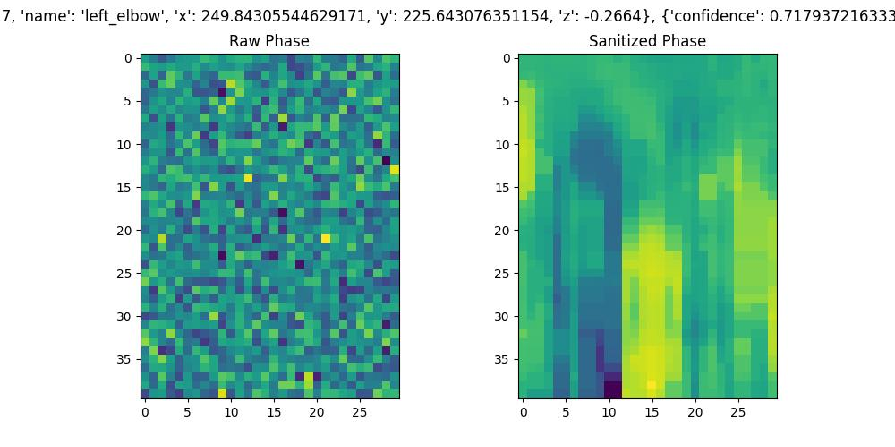

# RuView Phase Sanitization Enhancements

**Project**: Phase sanitization and preprocessing pipeline for [RuView](https://github.com/ruvnet/RuView)

**Based on** the paper:  
[**DensePose From WiFi**](https://arxiv.org/abs/2301.00250) by Jiaqi Geng, Dong Huang, Fernando De la Torre (CMU, 2022)

---

### Visualization Example



*Left: Raw noisy CSI phase*  *Right: Sanitized phase using method from the paper*

---

### Features

- Implements phase unwrapping + median filtering from the *DensePose From WiFi* paper
- Saves **full raw and sanitized phase arrays** in JSON format
- Ready for real Intel 5300 CSI data (research mode on ThinkPad T420)
- High-quality comparison plots
- Designed for future multi-view fusion (2+ laptops/sensors)

### Quick Start

```bash
# Terminal 1 - Start RuView
docker run -p 3000:3000 --name ruview --rm ruvnet/wifi-densepose:latest

# Terminal 2 - Start Phase Sanitizer
source ~/ruview_venv/bin/activate
cd ~/ruview-phase-sanitizer
./run.sh

Open http://localhost:3000 to see the RuView dashboard.Project Structure

ruview-phase-sanitizer/
├── phase_sanitizer_real.py     # Main script
├── run.sh                      # Easy launcher
├── README.md
├── requirements.txt
├── phase_data/                 # Full JSON phase arrays
├── phase_plots/                # Generated comparison images
└── notebooks/

AttributionThis work builds directly on:RuView by ruvnet
"DensePose From WiFi" paper

LicenseMIT License — see LICENSEMade for the WiFi sensing community.

